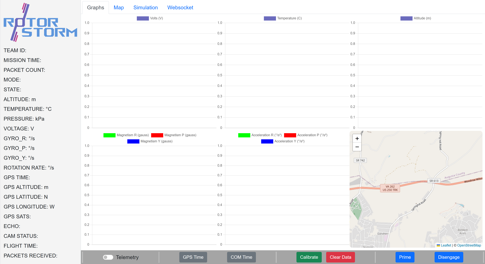

# Rotorstorm Ground Station

This project is CanSat team Rotorstorm's GCS for the 2024-2025 competition season.

## Requirements

This project requires an installation of python. It has been developed and tested on version 3.13

## Usage

To start the ground station: 

1. Plug an XBee into a serial port on your computer
2. Run main.py
3. Open index.html in your browser
4. Navigate to the Websocket tab. The Websocket URL should already be filled in to ws://localhost:8000
5. Click the connect button